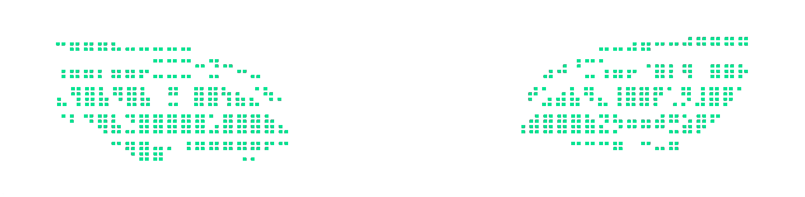

<div align="center">

  # **Cryptoblade**

  [](https://en.wikipedia.org/wiki/Python_(programming_language))
  []()

  

</div>

# Idea
If you ever wanted to hide your sensitive data like passwords, restoration keys or pretty much anything else, there's no better place than in plain sight.

Why would you ever need to hide your sensitive data somewhere away from your local storage?

Well, if you are like me and many others, have just ONE single drive storing your whole life identity - the first thing you will be worried about before your death are contents inside of it, you probably know that hard drives (both ssds and hdds) tend to fail. Once such disaster happens you are losing a lot and all your data is unrecoverable.

To prevent it you have to store your data not just in one single place, but in many other storage locations, like raid arrays of hard drives, usb sticks or clould solutions (which I wouldn't ever recommend for storing your sensitive data in unencrypted state) and do backups regularly.

One single thing you want to avoid at any given scenario is a leak of your data to the internet, this dark place will remember everything you've ever uploaded there. So free cloud solutions become unusable, right?

> [!NOTE]  
> Except you encrypt your data and you and only you know how to decrypt it back to it's original state.


# Note of warning
Yes, encrypting your sensitive data with this tool is safe under the right conditions, but the overall security depends on how you manage the encryption key and the environment where the data is stored.

We use AES-128 encryption in CBC mode, which is a highly secure symmetric encryption algorithm. AES-128 is widely trusted in cryptography and considered safe by modern standards.

Fernet also applies HMAC (Hash-based Message Authentication Code) using SHA-256 to ensure the integrity of the encrypted message. This prevents an attacker from tampering with the ciphertext without being detected.

Fernet uses a 32-byte (256-bit) key, which provides strong protection against brute-force attacks.

### Key Management:
The security of the encryption relies on the strength and secrecy of your key also known as 'passphrase'. As long as your key remains secret and is stored securely (or not stored at all), it will be extremely difficult for an attacker to decrypt your data, even if they possess the encrypted file.

> [!CAUTION]
> The biggest risk comes from how you handle and store the Fernet key. If someone gets access to the key, they can easily decrypt the data. Ensure your key is stored securely, such as in an HSM (Hardware Security Module) or a secure key management service.

### Can Fernet Be Cracked?
Brute-force Attack: Given the 256-bit key used in Fernet, brute-forcing is not a feasible attack. It would take astronomical amounts of time and computational power to try all possible keys.
Count of possible keys is approximately 10^77 (a 1 followed by 77 zeros).

Lets assume we possess an RTX 4090 with hashcat installed.
RTX 4090 hashing speed for AES-256, a typical performance benchmark for a single RTX 4090 is around 300,000 keys/second.

Using a single RTX 4090 at 300,000 keys/second, it would take approximately 1.06 × 10^64 years to brute-force a 256-bit key (10^77 possible keys).

This timespan is beyond comprehension and significantly longer than the current age of the universe. Hopefully the question is answered clearly.

### To sum up:
If you use a weak passphrase or expose your key accidentally, the encryption can be compromised. The weakness doesn’t come from code itself but from poor key management practices, or to simply put **humans**.

# Installation

Clone the project:
```bash
git clone git@github.com:aASDa213ASD/cryptoblade.git
cd cryptoblade/
```

Make yourself a virtual environment:
```bash
python -m venv .env/

# Activate your environment by running
source .env/bin/activate  # for Linux

.env\Scripts\activate.bat # for Windows
```

Install requirements:
```bash
pip install -r requirements.txt
```

Don't forget to put your files with sensitive data inside `data/raw/` for later encryption

Run the application:
```bash
cd src/
python run.py
```